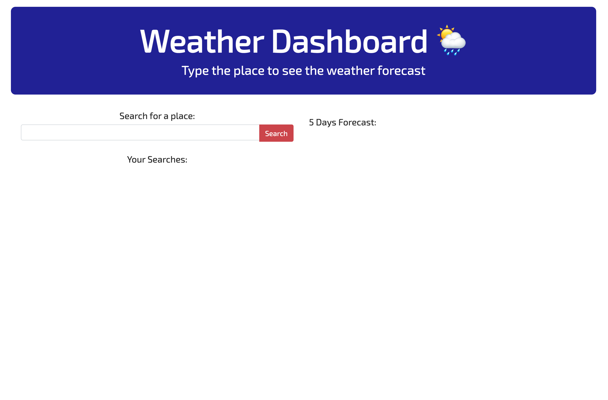
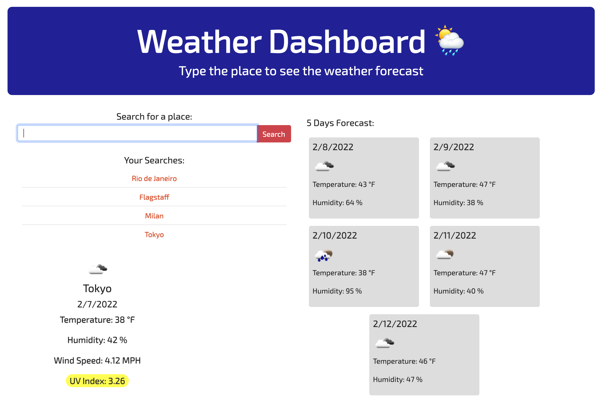

# Weather Dashboard
  

  <h2>Table of Contents</h2>
  
  * [Description](#description)
  * [Usage](#usage)
  * [Screenshots](#scrs)
  * [Link to the live site](#live)
  * [Questions](#questions)
  
  
  ## Description
  This is a weather-dashboard in which you can search for a weather current condition and also will receive a 5 days forecast. All your searches will be temporarily stored in the local storage. It does display the temperature, the date, the humidity, the wind speed, and the UV index with a color that indicates whether the conditions are favorable, moderate, or severe.To make this application I used HTML, CSS, Javascript, Axios, bootstrap. and had to register and account at openweather to obtain the key for the API.
  
  ## Usage
  Type the desired location by either clicking on the button search or hitting the enter key on your keyboard to start the weather search.
 
  
  ## Screenshots 
   
 
 

## Link to the live site 
<a href="https://ibarros19.github.io/weatherDashb/" target="_blank">https://ibarros19.github.io/weatherDashb/</a>
  ## Questions
  If you have any further questions, please feel free to contact me on GitHub at [ivibarros19](https://github.com/ivibarros19) or by email at [ivibarros19@gmail.com](ivibarros19@gmail.com).
